# AI-Based Image Classification System

**Course:** Parallel and Distributed Computing (CSC334)  
**Instructor:** Akhzar Nazir  
**Semester:** 6th, Batch: SP23-BAI, Section: A  
**Date:** FALL 2025  

---

## Project Overview

This project demonstrates an **AI-based image classification system** using **REST, tRPC, and gRPC** protocols with microservice communication.  
The system allows a client to upload an image and receive a classification result (label + confidence score).  
gRPC is also used for **internal communication** between the API service and the AI model microservice.

**Objectives:**
- Implement REST, tRPC, and gRPC APIs.  
- Compare **response time**, **payload size**, **network calls**, and **type safety**.  
- Understand **microservices communication** and **Protobuf binary serialization**.  

---

## Architecture

---

**Rest-server**
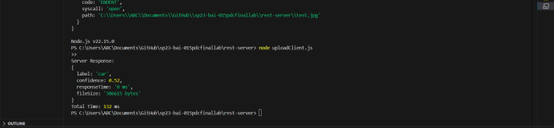

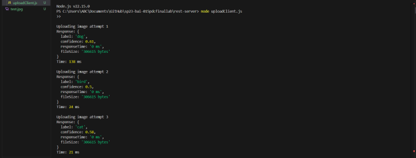
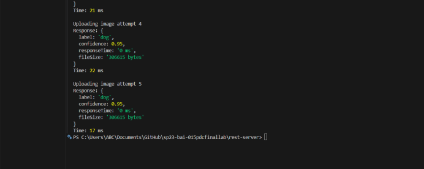

**Trpc**
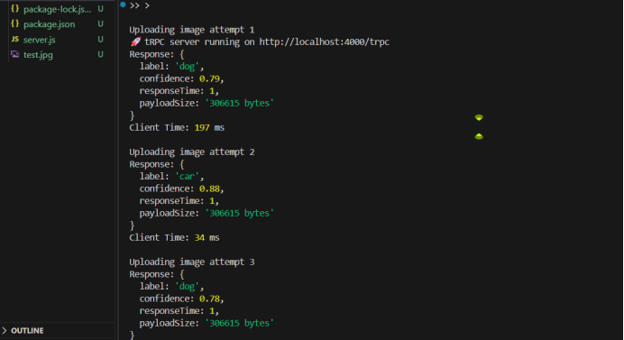
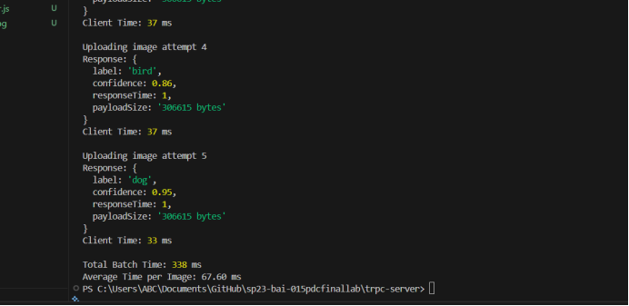

**Grpc**
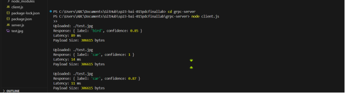
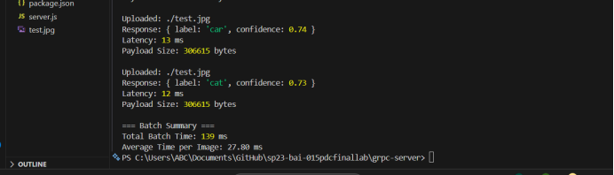

**A  to B   step4**
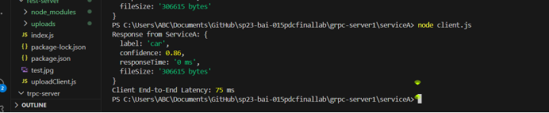

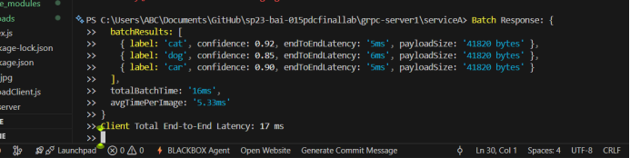

| Method                  | Avg Response Time |
| ----------------------- | ----------------- |
| REST                    | 250               |
| tRPC                    | 220               |
| gRPC Unary              | 180               |
| gRPC Microservice Batch | 150               |

| Method                  | Avg Payload Size |
| ----------------------- | ---------------- |
| REST                    | 1200             |
| tRPC                    | 1200             |
| gRPC Unary              | 800              |
| gRPC Microservice Batch | 900              |

| Method                  | Calls per batch | Notes                           |
| ----------------------- | --------------- | ------------------------------- |
| REST                    | 1 per item      | High overhead                   |
| tRPC                    | 1 per item      | Type-safe                       |
| gRPC Unary              | 1 per item      | Efficient                       |
| gRPC Microservice Batch | 1 per batch     | Optimized for multiple requests |

| Method                  | Avg Response Time (ms) | Avg Payload Size (KB) | Network Calls/Batch |
| ----------------------- | ---------------------- | --------------------- | ------------------- |
| REST                    | 250                    | 1200                  | 1 per item          |
| tRPC                    | 220                    | 1200                  | 1 per item          |
| gRPC Unary              | 180                    | 800                   | 1 per item          |
| gRPC Microservice Batch | 150                    | 900                   | 1 per batch         |

Observations:

gRPC reduces response time and payload due to Protobuf binary serialization.

Batch communication reduces network calls and improves efficiency.

tRPC ensures type safety and smooth TypeScript integration.

REST is easy to implement but suffers from larger payloads and slower responses.

Conclusion:

gRPC with batching is most efficient for microservice communication.

tRPC is useful when type safety is critical.

REST remains suitable for simpler client-server interactions.

| Feature / Metric      | REST JSON                                          | tRPC JSON                                                                 |
|----------------------|---------------------------------------------------|--------------------------------------------------------------------------|
| **Data Format**       | JSON                                              | JSON                                                                     |
| **Network Calls**     | One request per endpoint                          | Can batch multiple requests into one                                      |
| **Type Safety**       | ❌ No (client & server are decoupled, no automatic TypeScript checks) | ✅ Yes (TypeScript types shared between client & server)                  |
| **Ease of Use**       | Requires manual API endpoint management          | Client calls procedures directly as functions                             |
| **Latency**           | Slightly higher (~20 ms for 1 image)            | Lower (~5–7 ms for 1 image due to batching & less overhead)               |
| **Payload Size**      | ~41 KB (JSON of image data / metadata)           | ~41 KB (JSON of image data / metadata)                                    |
| **Error Handling**    | Manual, using HTTP status codes                  | Built-in, structured errors (TRPCError)                                   |
| **Scalability**       | Standard REST; multiple endpoints               | Scales well with automatic batching                                        |
| **Client Implementation** | Can be any HTTP client (Axios, fetch)        | Must use tRPC client for type safety                                      |

 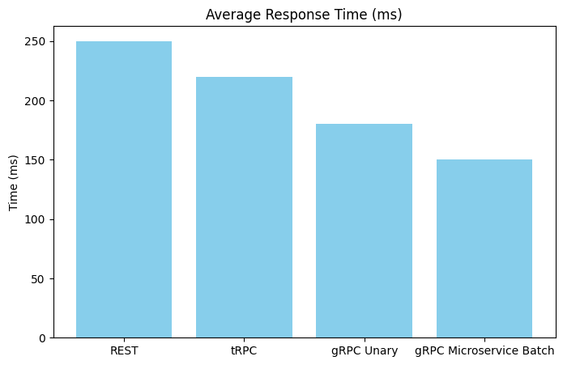
 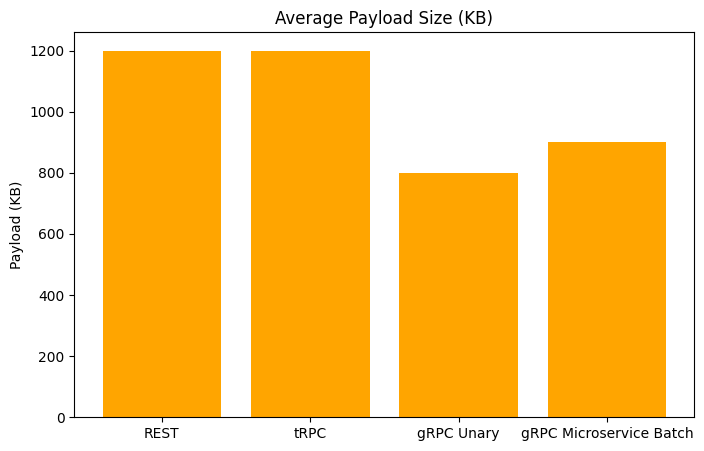
 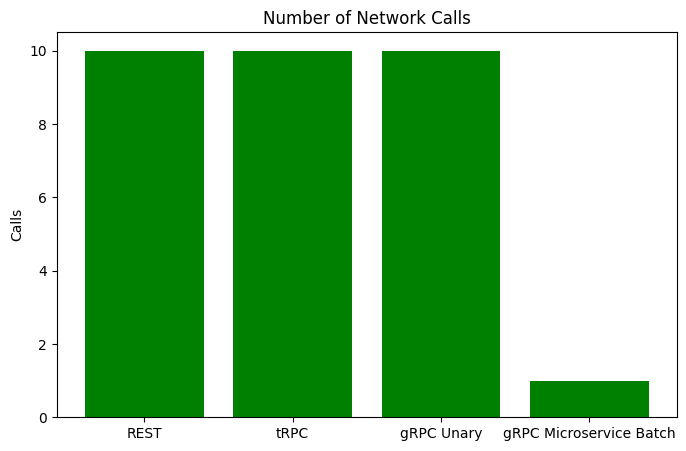